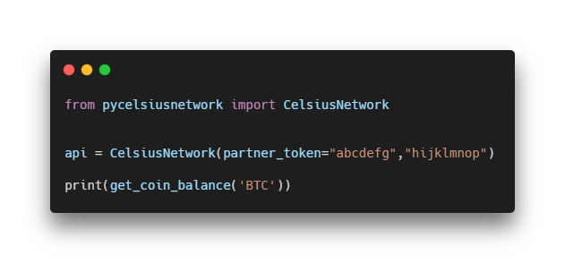

<div align="center">
	<a href="https://pypi.org/project/pycelsiusnetwork/" target="_blank">
    	
    </a>
    </div>

<h3 align="center">pyCelsiusNetwork</h3>
<p align="center">Unofficial Python Wrapper for the Celcius Network API</p>

<div align="center">
  
  <a href="https://pypi.org/project/pycelsiusnetwork/" target="_blank"></a>
  
</div>

<br/>

<h5 align="center"> 
🚧 Under development: Things will break and change abruptly. 🚧
</h5>

---

<p align="center">
    <a href="#what-is-this">What is this?</a> |
    <a href="#requirements">Requirements</a> |
    <a href="#installation">Installation</a> |
    <a href="#usage">Usage</a> |
    <a href="#roadmap">Roadmap</a> |
    <a href="#contributing">Contributing</a> |
    <a href="#license">License</a>
</p>

---

## What is this?
**pyCelsiusNetwork** is a Python API Wrapper for [Celsius Network](https://celsius.network/) public API.
This package also offers a short-and-sweet abstraction layer, with functions like depagination of API Results, reversing, and filtering, but the raw JSON response is always one paramether away.

## Requirements
You will need:
 - a Omnibus Treasury Partner Token, you can read on how to get one [here](https://developers.celsius.network/omnibus-treasury.html).
 - a Celsius Account API Key, you can read on how to generate one [here](https://developers.celsius.network/createAPIKey.html)
 - a computer with ``Python 3.5+`` and ``pip`` installed

## Installation
#### With ``pip``

```
$ pip install pycelsiusnetwork
```

#### Manual

1. Clone this repository
2. Run ```python setup.py install```

## Usage
Come back later.

## Roadmap

#### [Native API calls](https://documenter.getpostman.com/view/4207695/Rzn6v2mZ?version=latest#83677182-2cc9-4198-b574-77ad0862237b)
- [x] <small>``GET``</small> Balance summary
- [x] <small>``GET``</small> Balance for coin
- [x] <small>``GET``</small> Transactions summary
- [x] <small>``GET``</small> Transactions for coin
- [x] <small>``GET``</small> Get deposit address
- [ ] <small>``POST``</small> Withdraw
- [ ] <small>``GET``</small> Get withdrawal transaction id
- [x] <small>``GET``</small> Interest Rates
- [ ] <small>``GET`` ``POST``</small> KYC

#### Abstraction Layer
- [x] Option for returning raw JSON
- [x] Depagination for ``Transactions summary`` and ``Transactions for coin``
- [x] Filtering for ``Transactions summary`` and ``Transactions for coin``

## Contributing
Pull requests are welcome. For major changes, please open an issue first to discuss what you would like to change.

<!-- Please make sure to update tests as appropriate. -->

## License
[MIT](https://choosealicense.com/licenses/mit/)